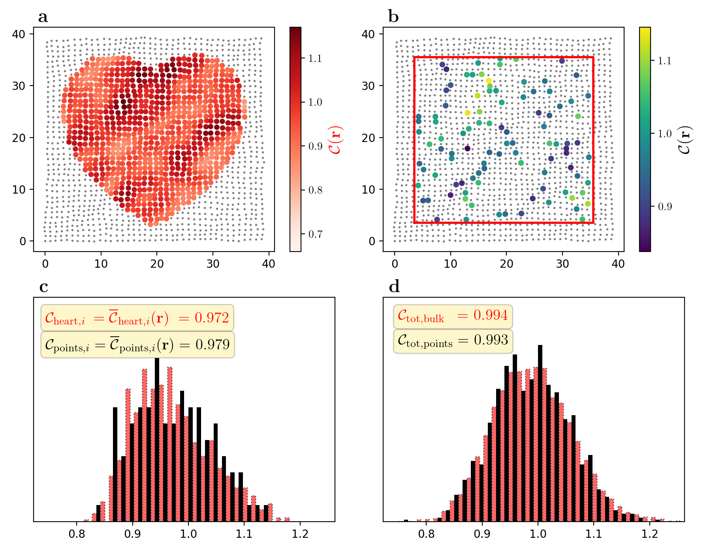

### Averaging a local topological marker in a non-crystalline system

For more details, see the paper: https://arxiv.org/abs/2301.XXXXX (will be added here in a few days)

In theoretical condensed matter physics, it is sometimes useful to calculate a local topological marker representing e.g. a Chern number, for a finite lattice. The average of this marker corresponds to the true topological index. For _non-crystalline_ systems, there exists substantial variation in the surroundings for each lattice point, and the local markers therefore also have significant fluctuations. Furthermore, the sum of the local Chern marker over the entire finite system gives zero, and this is seen in the borders behaving "erratically." Thus, to evaluate the topological index, it is useful to only consider bulk points. In practice, we exclude a finite-width border, and only take into account the inner points of the system.

But many neighboring points may have correlated values, and so averaging a local marker over all points may not be so useful. The set of points makes up the _distribution_ of local marker values, and calculating all of them can be computationally very costly. Here we show that _randomly_ choosing a set of points from the bulk is a good way to sample this distribution of local values. Repeating this over several random configurations very quickly converges to the mean value that we are after.


Running 
```bash
$ python plot_subDistr.py
```
produces and saves the figure **bulkHeart-vs-points_L40.png** here below.



In $\textbf{a}$, we show the local Chern marker $\mathcal{C}(\mathbf{r})$ calculated ~~for all of the~~— I mean for _most_ of the bulk points, and they show significant fluctuations. In $\textbf{b}$, we sample the marker at random points within the red boundary which defines the bulk.
The distributions corresponding to the sample configuration in $\textbf{a}$ and $\textbf{b}$ are shown in $\textbf{c}$. The distributions are not of very high quality, and the few random points certainly do not make up a good final result.
The average local marker for both the random points (in red) and the bulk points (in black) are decent, but clearly deviate from the true value 1. \
Now, repeating this process for $N=10$ configurations means we are getting closer to the true distribution of values, and that gives us $\textbf{d}$, where all calculated values have been included. In black, we this time show all bulk points — not just the heart :) — inside the red borders, and see that the distributions match very well, including predicting almost exactly the same mean value for the local Chern marker. \
This shows that randomly sampling only a small fraction of points within the bulk of the system is an efficient way to calculate the average of the local marker values. This is especially true when scaling up the system size; as long as $N$ is not too small, it is still enough to "sample" the distribution for a given configuration, and repeating this for several configurations gives a good prediction for the Chern number.


### To be added
- Calculation of the data file, used for the above plotting script